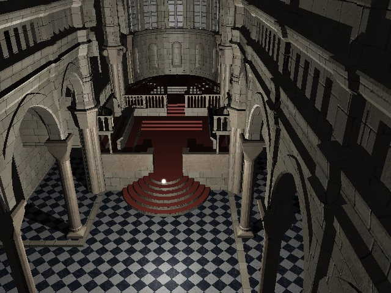
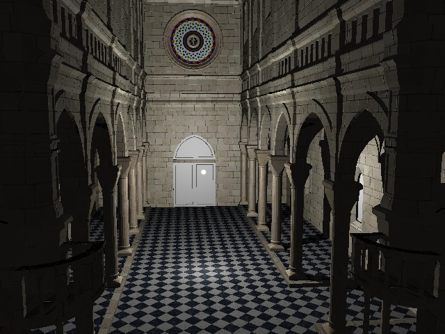
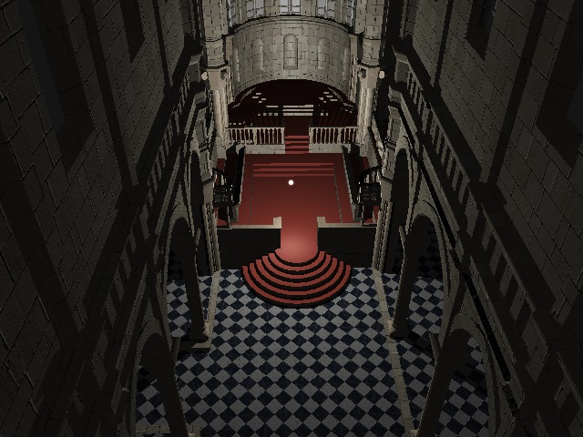

# Raytracer

A real-time raytracer in a WebGL2 fragment shader that reads a kd-tree and mesh data from a texture (generated with a blender plugin).

You can try it [online here](http://ahilus.github.io/Raytracer/demo.html).

There is also a shadron version available.

# Controls

* w = forward
* s = backward
* a = strafe left
* d = strafe right
* q = descend
* e = ascend
* left mouse click on canvas to enter/exit mouse look

# Screenshots

## TODO

* test if raymarching is any faster
* add mipmapping, texture filtering
* implement keyframes for camera and lights
* use blender's lighting equations instead
