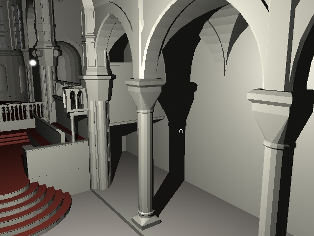
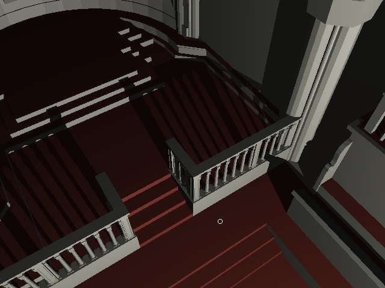
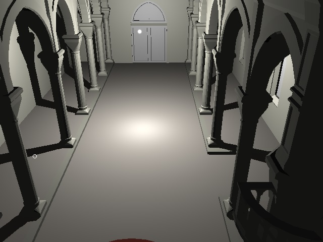

# Raytracer

A real-time raytracer in a WebGL2 fragment shader that reads a kd-tree and mesh data from a texture (generated with a blender plugin).

You can try the [raytracer here](http://andrewhills.github.io/raytracer/demo.html). The controls are just a left click to look around.

